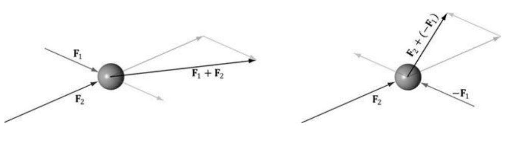
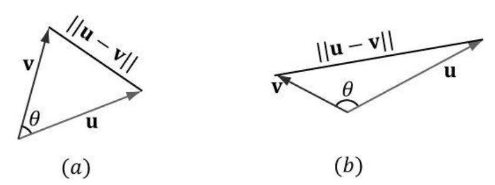
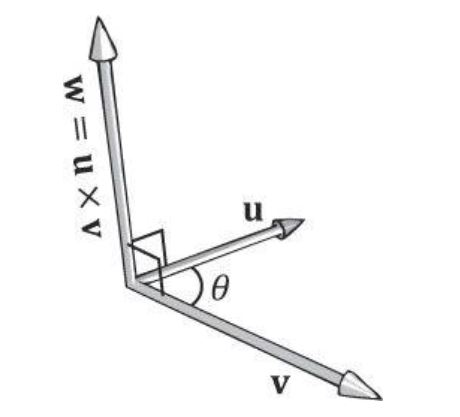
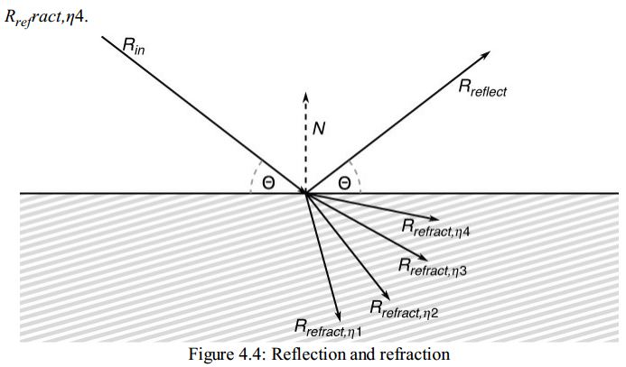

# 【OpenGL】-002 OpenGL数学基础
&emsp;&emsp;这是我看OpenGL书时的数学笔记。

[TOC]

##1、Vector

### 1.1 意义
&emsp;&emsp;**顶点**是OpenGL中的一个重要的输入，表示空间中的一个位置，通常可以用一个向量来表示,即一个xyz空间中的三元组。三元组(x,y,z)表示不仅表示了位置还表示了长度（向量的模）。

&emsp;&emsp;向量$(x,y,z)$的模计算公式如下：
&emsp;&emsp;$|(x,y,z)|=\sqrt{x^2+y^2+z^2}$

### 1.2 向量加减
&emsp;&emsp;向量$\vec{a}=(a_x,a_y,a_z)$,向量$\vec{b}=(b_x,b_y,b_z)$,则向量加减法计算方式如下：
&emsp;&emsp;$\vec{a}+\vec{b} = (a_x+b_x,a_y+b_y,a_z+b_z)$
&emsp;&emsp;$\vec{a}-\vec{b} = (a_x-b_x,a_y-b_y,a_z-b_z)$

### 1.3 点乘
&emsp;&emsp;向量$\vec{a}=(a_x,a_y,a_z)$,向量$\vec{b}=(b_x,b_y,b_z)$,则向量点乘计算方法如下：
&emsp;&emsp;$\vec{a}·\vec{b}=a_xb_x+a_yb_y+a_zb_z=||\vec{a}||·||\vec{b}||·cos(\theta)$
&emsp;&emsp;其中$\theta$是$\vec{a}$与$\vec{b}$的夹角，$0\leq\theta\leq\pi$

&emsp;&emsp;根据向量的以上性质，可以用于求两个向量的夹角大小：
$cos(\theta)=\frac{\vec{a}·\vec{b}}{||\vec{a}||·||\vec{b}||}=\frac{a_xb_x+a_yb_y+a_zb_z}{||\vec{a}||·||\vec{b}||}$
如果$\vec{a}$与$\vec{b}$是单位向量，则$||\vec{a}||=1$,$||\vec{b}||=1$，此时
$cos(\theta)=a_xb_x+a_yb_y+a_zb_z$。
**向量点乘的性质**
(1) 如果$\vec{a}·\vec{b}=0$,则$\vec{a}$&perp;$\vec{b}$.
(2) 如果$\vec{a}·\vec{b}>0$,则$0\leq\theta<\frac{\pi}{2}$.
(3) 如果$\vec{a}·\vec{b}<0$,则$\frac{\pi}{2}<\theta\leq\pi$.

### 1.4 叉乘
&emsp;&emsp;向量$\vec{a}=(a_x,a_y,a_z)$,向量$\vec{b}=(b_x,b_y,b_z)$,则向量叉乘计算方法如下：
&emsp;&emsp;$\vec{w}=\vec{a}\times\vec{b}=(a_yb_z-a_zb_y,a_xb_z-a_zb_x,a_xb_y-a_yb_x)=||\vec{a}||·||\vec{b}||·sin(\theta)·\vec{n}$,其中$\vec{n}$是垂直与这两个向量组成的平面的单位向量。

&emsp;&emsp;由此可以看出，两个向量的叉乘的结果仍然是一个向量，该向量垂直于由向量$\vec{a}$与$\vec{b}$确定的平面，即$\vec{w}$&perp;$\vec{a}$，$\vec{w}$&perp;$\vec{b}$.
&emsp;&emsp;$\vec{w}$的方向遵循右手定则，手指指向第一个向量，向第二个向量蜷缩手指，角度范围在$0\leq\theta\leq\pi$,此时，拇指的方向即为$\vec{w}$的方向。

### 1.5 反射与透射
&emsp;&emsp;入射向量$\vec{R_{in}}$,界面法向向量$\vec{N}$,入射角度为$\theta$,折射率为$\eta$,反射向量记为$\vec{R_{reflect}}$,折射向量记为$\vec{R_{(refract,\eta)}}$.则有如下计算公式成立：
&emsp;&emsp;$\vec{R_{reflect}}=\vec{R_{in}}-(2\vec{N}·\vec{R_{in}})\vec{N}$
折射向量计算方法如下：
&emsp;&emsp;$k=1-\eta^2(1-(\vec{N}\vec{R_{in}})^2)$
$$\vec{R_{(refract,\eta)}}=\left\{\begin{array}{cc} 
		0.0, & k<0.0\\
		\eta\vec{R_{in}}-(\eta(\vec{N}\vec{R_{in}})+\sqrt{k})\vec{N}, & k\geq0.0 
	\end{array}\right.$$

