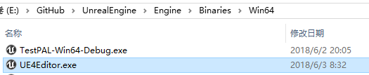

# 【UE4源代码分析】-005 Editor的起点-Main函数
## 1、UE4-Editor的运行
### 1.1 UE4编辑器的位置
&emsp;&emsp;**UE4.sln**编译完之后，在输出目录下会生成UE4Editor.exe,(图1所示)。
<div align=center>

</div>
<div align=center>图1 UE4Editor.exe</div><br/>

&emsp;&emsp;双击**UE4Editor.exe**即可启动经过我们自己编译的UE4编辑器。
### 1.2 UE4编辑器启动过程
&emsp;&emsp;双击启动**UE4Editor.exe**之后，编辑器开始运行，首先会弹出程序启动画面，在该界面上显示编辑器启动过程以及进度。
<div align=center>

</div>
<div align=center>图2 UE4Editor启动界面Splash Screen</div><br/>

&emsp;&emsp;启动界面上标明了当前启动的UE4引擎的版本-4.19.2，以及当前加载的进度。
<div align=center>

</div>
<div align=center>图3 UE4Editor启动界面Splash Screen带加载进度</div><br/>

&emsp;&emsp;在完成了加载之后，程序进度已有工程选择界面，在该界面上，用户可以选择系统中已经存在的UE4项目进行编辑，**注意**：这里列出的项目包括计算机上历史版本的UE4引擎所创建的项目。
<div align=center>

</div>
<div align=center>图4 UE4Editor选择项目</div><br/>

&emsp;&emsp;用户可以通过单击**新建项目**选项卡，进入新建项目界面。
<div align=center>

</div>
<div align=center>图5 UE4Editor新建项目</div><br/>

&emsp;&emsp;用户通过新建项目选项卡输入项目名称和存储位置之后，UE4会创建项目。可供创建的项目主要由两种类型——蓝图项目和C++项目。蓝图项目开发过程中，主要使用UE蓝图脚本进行开发，而C++项目主要使用C++语言在VS编辑器中进行开发。
&emsp;&emsp;这里，我选择创建C++空白项目。UE4编辑器完成项目文件的创建之后，自动使用VS2015打开了我刚才创建的C++空白项目(项目名称**p1**)。
&emsp;&emsp;项目文件目录结构如图所示。
<div align=center>

</div>
<div align=center>图6 UE4Editor新建空白C++项目文件组织</div><br/>

&emsp;&emsp;从图6中可以看出，与UE4引擎源代码工程相比，p1项目多了一个Game项目，该项目为p1游戏的项目代码所在的位置。
&emsp;&emsp;至此，我们已经完成了用UE4编辑器创建UE4游戏的项目，可以在其中自由的编写项目代码，进行游戏开发了。
&emsp;&emsp;那么，**UE4编辑器到底是怎么运行起来的呢？**
## 2、函数调用起点
&emsp;&emsp;UE4引擎是使用C++语言开发的，伟大的《C语言》、《C++》、《Windows程序设计》告诉我们，win32程序通常是从main函数或者WinMain函数开始执行的。(*排除全局变量构造等情况，只按常规套路出牌。*) 那么UE4Editor.exe是不是也是从这里开始执行的呢？
&emsp;&emsp;在Engine\Source\Runtime\Launch\Private\Windows\LaunchWindows.cpp中有WinMain函数。
```C++
int32 WINAPI WinMain( _In_ HINSTANCE hInInstance, _In_opt_ HINSTANCE hPrevInstance, _In_ char*, _In_ int32 nCmdShow )
{
	// Setup common Windows settings
	SetupWindowsEnvironment();

	int32 ErrorLevel			= 0;
	hInstance				= hInInstance;
	const TCHAR* CmdLine = ::GetCommandLineW();

#if !(UE_BUILD_SHIPPING && WITH_EDITOR)
	// Named mutex we use to figure out whether we are the first instance of the game running. This is needed to e.g.
	// make sure there is no contention when trying to save the shader cache.
	GIsFirstInstance = MakeNamedMutex( CmdLine );

	if ( FParse::Param( CmdLine,TEXT("crashreports") ) )
	{
		GAlwaysReportCrash = true;
	}
#endif

	// Using the -noinnerexception parameter will disable the exception handler within native C++, which is call from managed code,
	// which is called from this function.
	// The default case is to have three wrapped exception handlers 
	// Native: WinMain() -> Native: GuardedMainWrapper().
	// The inner exception handler in GuardedMainWrapper() catches crashes/asserts in native C++ code and is the only way to get the
	// correct callstack when running a 64-bit executable. However, XAudio2 sometimes (?) don't like this and it may result in no sound.
#ifdef _WIN64
	if ( FParse::Param(CmdLine,TEXT("noinnerexception")) || FApp::IsBenchmarking() )
	{
		GEnableInnerException = false;
	}
#endif	

#if WINVER > 0x502	// Windows Error Reporting is not supported on Windows XP
	if (FParse::Param(CmdLine, TEXT("useautoreporter")))
#endif
	{
		GUseCrashReportClient = false;
	}

#if UE_BUILD_DEBUG
	if( true && !GAlwaysReportCrash )
#else
	if( FPlatformMisc::IsDebuggerPresent() && !GAlwaysReportCrash )
#endif
	{
		// Don't use exception handling when a debugger is attached to exactly trap the crash. This does NOT check
		// whether we are the first instance or not!
		ErrorLevel = GuardedMain( CmdLine, hInInstance, hPrevInstance, nCmdShow );
	}
	else
	{
		// Install an unhandled exception filter, to catch any exceptions on threads that are not created by the engine.
		SetUnhandledExceptionFilter(UnhandledException);

		// Use structured exception handling to trap any crashes, walk the the stack and display a crash dialog box.
#if !PLATFORM_SEH_EXCEPTIONS_DISABLED
		__try
#endif
 		{
			GIsGuarded = 1;
			// Run the guarded code.
			ErrorLevel = GuardedMainWrapper( CmdLine, hInInstance, hPrevInstance, nCmdShow );
			GIsGuarded = 0;
		}
#if !PLATFORM_SEH_EXCEPTIONS_DISABLED
		__except( GEnableInnerException ? EXCEPTION_EXECUTE_HANDLER : ReportCrash( GetExceptionInformation( ) ) )
		{
#if !(UE_BUILD_SHIPPING && WITH_EDITOR)
			// Release the mutex in the error case to ensure subsequent runs don't find it.
			ReleaseNamedMutex();
#endif
			// Crashed.
			ErrorLevel = 1;
			if(GError)
			{
				GError->HandleError();
			}
			LaunchStaticShutdownAfterError();
			FPlatformMallocCrash::Get().PrintPoolsUsage();
			FPlatformMisc::RequestExit( true );
		}
#endif
	}

	// Final shut down.
	FEngineLoop::AppExit();

#if !(UE_BUILD_SHIPPING && WITH_EDITOR)
	// Release the named mutex again now that we are done.
	ReleaseNamedMutex();
#endif

	

	// pause if we should
	if (GShouldPauseBeforeExit)
	{
		Sleep(INFINITE);
	}

	return ErrorLevel;
}

```
&emsp;&emsp;从以上的函数实现可以看出，对于UE4的WinMain函数，主要执行的工作是设置windows环境，创建命名Mutex，根据参数不同使用不同形式调用`GuardedMain`函数。在`GuardedMain`函数退出之后，结束引擎的循环，并释放命名Mutex，退出程序。
&emsp;&emsp;从上面可以看出，在WinMain函数中，主要工作是根据不同的参数，采用合适的形式调用GuardedMain函数，实际上对引擎的调用和其余工作都是在GuardedMain函数中完成的。
## 3、思考
&emsp;&emsp;由于UE4对windows的头文件进行了极大的裁剪，并且为了保持对出错之后生成dump文件或Crash报告的能力的支持，由于在`WinMain`函数中不具备这个能力，所以将大部分工作转移到`GuardedMain`函数中执行。
