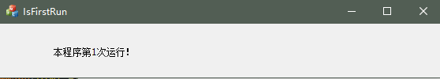
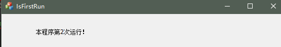

# 【UE4源代码分析】-006 检查程序是否是第一个实例]
&emsp;&emsp;本文主要结合在工作中遇到的需要保持在一台计算机上只允许一个程序实例运行的需求，结合在阅读UE4源代码的时候关于`NamedMutex`的一点思考，记录下如果检测程序是否是本计算机上运行的第一个实例的问题。

[TOC]


## 1、问题的由来
&emsp;&emsp;最近在开发过程中，由于软件需要和计算机的数据采集卡硬件打交道，数据采集卡SDK在重复初始化的时候会初始化失败。虽然在初始化失败的时候回弹出窗口并退出程序，但在客户体验来说有点low。
&emsp;&emsp;由于我平时是网易云音乐的用户，在使用网易云音乐的时候发现，当在一台计算机上已经运行了一个客户端的情况下，第二次启动网易云音乐的请求会直接把第一个程序实例的主界面显示出来，既响应了用户的运行请求，又不会弹出警告框影响用户体验。
&emsp;&emsp;这两件事的内在都是程序开始运行之后，如何检测自己是不是第一个运行的该应用程序的实例。
## 2、UE4的启发
&emsp;&emsp;在上一篇**【UE4源代码分析】-005 Editor的起点-Main函数**中，在分析UE4编辑器的启动过程中，发现`WinMain`函数在设置了windows环境之后，紧接着就进行的工作是`GIsFirstInstance = MakeNamedMutex( CmdLine )`。在`MakeNamedMutex`函数中，主要进行了以下操作：
```C++
bool MakeNamedMutex( const TCHAR* CmdLine )
{
	bool bIsFirstInstance = false;

	TCHAR MutexName[MAX_SPRINTF] = TEXT( "" );

	FCString::Strcpy( MutexName, MAX_SPRINTF, TEXT( "UnrealEngine4" ) );

	GNamedMutex = CreateMutex( NULL, true, MutexName );

	if( GNamedMutex	&& GetLastError() != ERROR_ALREADY_EXISTS && !FParse::Param( CmdLine, TEXT( "NEVERFIRST" ) ) )
	{
		// We're the first instance!
		bIsFirstInstance = true;
	}
	else
	{
		// Still need to release it in this case, because it gave us a valid copy
		ReleaseNamedMutex();
		// There is already another instance of the game running.
		bIsFirstInstance = false;
	}

	return( bIsFirstInstance );
}
```
&emsp;&emsp;程序的流程如下：
```flow
st=>start: 开始
e=>end: 结束
InitVaribale=>operation: 设置内部变量状态
CreateMutex=>operation: 创建命名Mutex
SetReturnValueTrue=>operation: 设置返回值状态True
SetReturnValueFalse=>operation: 设置返回值状态False
ReleaseMutex=>operation: 释放Mutex Handle
cond1=>condition: Handle是否有效
cond2=>condition: Mutex是否已经存在
cond3=>condition: 带NEVERFIRST参数

st->InitVaribale->CreateMutex->cond1
cond1(yes)->cond2
cond1(no)->ReleaseMutex
cond2(yes)->cond3
cond2(no)->ReleaseMutex
cond3(yes)->SetReturnValueTrue
cond3(no)->ReleaseMutex
ReleaseMutex->SetReturnValueFalse
SetReturnValueFalse->e
SetReturnValueTrue->e
```
图1 UE4启动过程CreateNamedMutex流程图


&emsp;&emsp;**Mutex的性质**
- Mutex是系统内核的对象，可以用于线程或进程之间的同步；
- Mutex是互斥体，同一时刻只有多个线程或进程中的一个拥有该对象；
- Mutex分为命名互斥体和未命名互斥体两类；
- 未命名互斥体只能用于单个进程的多个线程之间同步资源；
- 命名的互斥体可以用于不同进程之间同步资源。
&emsp;&emsp;从以上性质可以看出，当程序的第一个实例开始运行的时候，调用`CreateMutex`创建一个命名的互斥体，之后的程序实例视图调用`CreateMutex`创建命名互斥体的时候由于已经存在该名称的互斥体，所以`CreateMutex`调用会设置最近错误为`ERROR_ALREADY_EXISTS`，表示该互斥体已经存在。通过该错误即可检测程序是不是第一个运行的实例。
## 3、实现
&emsp;&emsp;本文使用命名Mutex+计数变量的形式来记录程序的运行次数。
- 新建MFC对话框项目
&emsp;&emsp;建议带上最大化最小化按钮，方便演示类似网易云音乐的第二次运行直接弹出第一次运行窗口的功能。
&emsp;&emsp;本文中工程名为*IsFirstRun*，VS自动生成IsFirstRun.h,IsFirstRun.cpp,IsFirstRunDlg.h,IsFirstRunDlg.cpp等文件。
- 定义全局资源
&emsp;&emsp;在IsFirstRunApp.cpp,定义全局变量：
```C++
    HANDLE g_hMutex = NULL;
    const CString g_cstrMutexName = L"IsFirstRunMutex";
```
&emsp;&emsp;其中`g_cstrMutexName`表示我们要命名的Mutex对象名称。
&emsp;&emsp;在窗口上放置一个static text控件，并将空间ID改为IDC_SHOW_MSG.
- 创建命名Mutex
&emsp;&emsp;在`CIsFirstRunApp()`中添加代码：
```C++
    //尝试创建命名Mutex对象
	g_hMutex = CreateMutex(NULL, FALSE, g_cstrMutexName);
	if (g_hMutex && ERROR_ALREADY_EXISTS == GetLastError())
	{//命名Mutex已经存在
        //通过程序名称查找窗口
		CWnd* pWnd = CWnd::FindWindow(NULL, _T("IsFirstRun"));
		//向该窗口发送自定义消息
        SendMessage(pWnd->GetSafeHwnd(), WM_USER + 1001, 0, 0);
		//此时仍然需要释放该Mutex HANDLE
        ReleaseMutex(g_hMutex);
        //退出程序
		exit(0);
	}
```
&emsp;&emsp;之所以在`CIsFirstRunApp()`构造函数中进行命名Mutex的创建，是为了对原有程序实例产生尽量小的影响，实际上这个创建过程可以放到Dlg的OnInitDlg中进行。
&emsp;&emsp;此处创建失败的处理过程是向已经运行的程序实例发送了一个自定义消息WM_USER+1001。因此，需要添加对这个自定义消息的处理。
- 自定义消息的处理
&emsp;&emsp;在IsFirstRunDlg.h中添加消息响应函数声明：
`afx_msg LRESULT OnSencodRun(WPARAM, LPARAM);`
并添加用于记录程序运行次数的成员变量：`int m_nRunTimes;`并初始化值为1.
在`BOOL CIsFirstRunDlg::OnInitDialog()`中设置显示信息的初始值：
```C++
	CString str(L"本程序第1次运行！");
	GetDlgItem(IDC_SHOW_MSG)->SetWindowTextW(str);
```
&emsp;&emsp;在IsFirstRunDlg.cpp中的消息映射表中添加自定义消息的消息映射：
`ON_MESSAGE(WM_USER+1001,&CIsFirstRunDlg::OnSencodRun)`
&emsp;&emsp;实现`CIsFirstRunDlg::OnSencodRun`函数：
```C++
LRESULT CIsFirstRunDlg::OnSencodRun(WPARAM, LPARAM)
{
    //运行次数累加
	m_nRunTimes += 1;
	CString temp;
	temp.Format(L"本程序第%d次运行！", m_nRunTimes);
	//设置界面上程序运行次数提示
    GetDlgItem(IDC_SHOW_MSG)->SetWindowTextW(temp);
	//显示主窗口
    ShowWindow(SW_SHOWNORMAL);
	return 0;
}
```
- 窗口关闭时释放Mutex
&emsp;&emsp;由于命名Mutex是系统核心对象，如果程序退出时不关闭该对象，系统不会自动清理并关闭该对象，因此，需要在程序退出时手动关闭该对象。
&emsp;&emsp;我们可以选择在窗口关闭的时候关闭该对象。
&emsp;&emsp;为窗口添加WM_CLOSE消息响应函数，并在其中释放Mutex。
```C++
void CIsFirstRunDlg::OnClose()
{
	// TODO: 在此添加消息处理程序代码和/或调用默认值
	if (g_hMutex)
	{
		ReleaseMutex(g_hMutex);
		g_hMutex = NULL;
	}
	CDialogEx::OnClose();
}
```
- 运行效果
&emsp;&emsp;程序第一次运行时效果图如下：

&emsp;&emsp;程序第二次运行时效果图如下：

&emsp;&emsp;如果第二次程序尝试启动时，第一次运行的程序已经处于最小化状态，尝试第二次运行程序会将第一次运行程序的主界面显示出来。

## 4、总结
&emsp;&emsp;检测程序是否是第一个运行实例或者是检测程序是第几个运行实例本质上是一个进程间通信的问题，只需要在程序启动的时候去检测特定位置的资源状态即可。
&emsp;&emsp;实际上，除了使用系统的命名核心对象之外，我们还可以采用诸如硬盘文件、系统注册表等手段记录程序运行次数，在程序启动时检测该值得出程序的运行次数。

PS：WIN10 + VS2015工程，
代码地址：https://github.com/freehawkzk/IsFirstRun.git