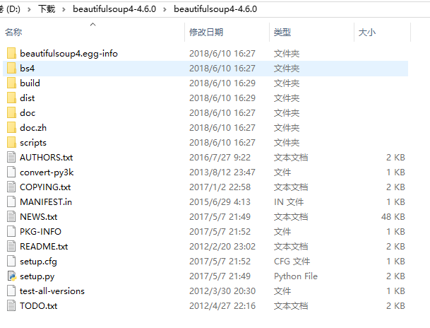
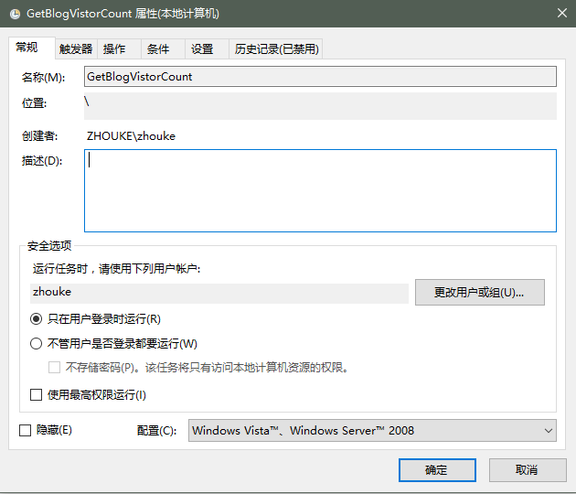
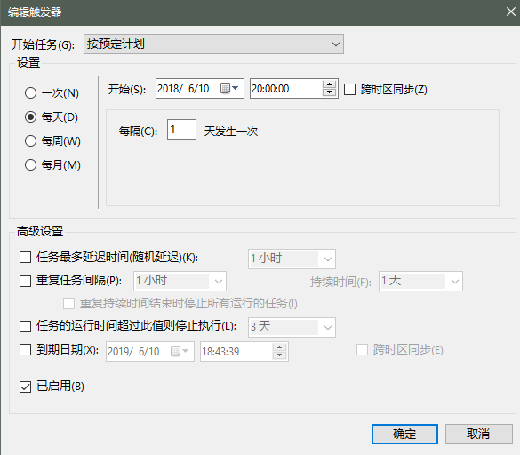
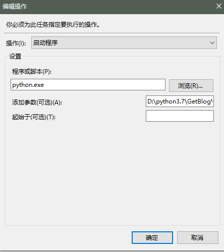

# 【Python】-001 获取CSDN博客访问数
&emsp;&emsp;最近在CSDN上写博客，看着访问数逐渐增加还是挺好玩的。但每次都需要点开来看并且没有访问数曲线记录，所以想着自己弄一个。本文主要是解决获取CSDN博客的访问数的问题。
## 1、工具及安装
&emsp;&emsp;这个需求的本质是请求网页数据->获取返回结果->html文档解析->数据保存这些工作。
&emsp;&emsp;其中主要涉及到的python包有urllib,beautifulsoup,time,re。其中各包的作用如下表所示
|包名|作用|
|----|----|
|urllib|发起网页请求并接收服务器返回|
|beautifulsoup|解析网页返回数据|
|time|获取当前时间|
|re|正则匹配|
&emsp;&emsp;**beautifulsoup**包需要自定义安装，从其官网上下载包(https://www.crummy.com/software/BeautifulSoup/),当前可下载的最新版本是4.6，下载包，解压。

<div align=center>图1 beautifulsoup目录结构</div>
&emsp;&emsp;使用python执行setup.py脚本，待执行完成后检查beautifulsoup是否安装成功。
## 2、代码
```Python
# -*- coding: UTF-8 -*-
from urllib import request
from bs4 import BeautifulSoup
import time
import re
if __name__ == "__main__":
    #1. Open the url by urllib
    response = request.urlopen("https://blog.csdn.net/freehawkzk")
    #2. Receive the response
    html = response.read()
    #3. Decode to fromat a human readable heml string
    html = html.decode("utf-8")
    #4. Parser the string 
    soup = BeautifulSoup(html,"html.parser")
    #5. According to view the source file of the aim page in firefox,
    #We have known that the aim node is named <dd> node, and the node
    #have a attribute named "title", the aim value is the value of <dd>
    #So firstly, we find all dd node
    dds = soup.find_all(re.compile("^dd"))
    for dd in dds:
        #Secondly, find the first node that have attributes
        if dd.attrs:
          #Get the value by key
          str1 = dd.attrs["title"]
          #Get current time
          timestr = time.strftime('%Y-%m-%d %H:%M:%S',time.localtime(time.time()))
          #6. Open file and save value
          with open(r'd:\blogVistorCount.txt', 'a+') as f:
            f.write(str1+" _ "+timestr + '\n')
          #7. Stop
          break
```
## 3、定时执行
&emsp;&emsp;由于我是在windows10平台上进行的操作，所以采用的是windows的计划任务的方式来定时执行脚本。实现的效果是每天晚上20点执行请求并记录数据。
&emsp;&emsp;


