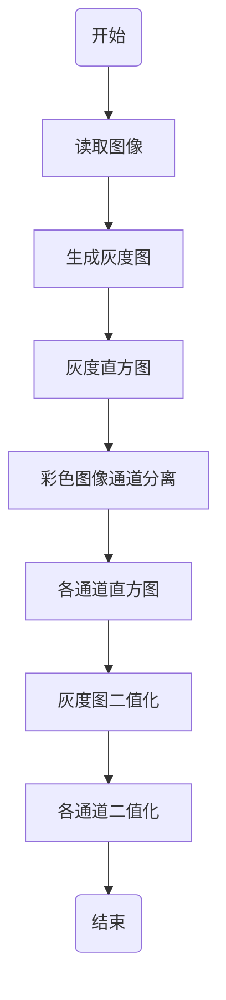

图像灰度化+二值化+直方图

&emsp;&emsp;本文主要用于记录将彩色图像转换成灰度图，分别计算彩色图像各个通道以及灰度图的直方图，将各个通道以及灰度图分别二值化并显示结果。

[TOC]

# 1 处理流程
&emsp;&emsp;
<div align=center>



<div align=left>

# 2 准备知识

## 2.1 彩色图像通道

&emsp;&emsp;彩色图像用于记录真实场景，根据选择的色彩空间的不同，可以分为`HSV,HSL,RGB,BGR`等形式。在某一个色彩空间中，记录图像在该色彩空间中的某一个指标的值组成了该图像的一个通道。
&emsp;&emsp;例如，在`RGB`色彩空间中，一个颜色由`R\G\B`三种色彩之描述，那么所有描述`R`色彩的值组成了该图像的`R`通道。通常，`RGB`色彩空间可以分为`R`,`G`,`B`三个通道，`HSV`空间可以分为`H`,`S`,`V`三个通道。

## 2.2 彩色转灰度

&emsp;&ensp;常用的彩色转灰度的计算公式如下：
$$
Gray = 0.299R+0.587G+0.114B
$$
&emsp;&emsp;可以看出，通过将`RGB`空间中各个通道的值进行加权计算，可以得出对应的灰度图。

## 2.3 直方图

&emsp;&emsp;图像的直方图是一个二维的统计图表，描绘了图像各个灰度值或各个亮度区间内的像素的分布数目，显示了各个亮度区间内像素数出现的概率或频率。当用各个亮度区间内出现次数除以整个亮度区间内出现次数的最大值时得到归一化的直方图，可以用于描述各区间内像素出现的概率。

&emsp;&emsp;直方图的作用如下：
- (1) 直方图可以反映图像的亮度. 在直方图上，如果大部分像素都分布在低亮度区域，则说明图像整体较暗；反之则说明图像整体亮度较大。
- (2) 直方图可以反应图像的对比度. 高对比度图像的直方图分布较为均匀，低对比度图像的直方图分布较为集中。

## 2.4 图像二值化

&emsp;&emsp;通常，根据传感器或图像数据类型不同，图像的具体数值可以分为很多，比如通常状态下，灰度图中像素的数据可以选`[0,255]`之间的任意一个值，如果数据使用10位表示，那么数据可选`[0,2^10-1]`中的任意一个值。图像二值化就是通过设定一个阈值，将图像数据与该阈值比较，大于该阈值的像素赋值位1，小于该阈值的像素赋值为0，等于该阈值的像素的值需要根据具体实现来确定。可见，经过二值化之后的图像只有0和1两种可选的取值。

# 3 Matlab实现

## 3.1 实现
```Matlab
clc;
clear;
close all;

% 读取彩色图像
ori_img = imread('../images/6.jpg');
figure(1),imshow(ori_img),title('原图');

% 彩色图像转灰度图像
gray_img = rgb2gray(ori_img);
figure(2),imshow(gray_img),title('灰度图');

% 计算灰度图像的直方图
[gray_hist,x] = imhist(gray_img);
figure(3),stem(x,gray_hist),title('灰度直方图');
maxCount = max(gray_hist);
gray_hist = gray_hist/maxCount;
figure(4),stem(x,gray_hist),title('归一化灰度直方图');

% 计算彩色图像R\G\B三个通道分别的直方图
r = ori_img(:,:,1);
g = ori_img(:,:,2);
b = ori_img(:,:,3);
figure(5),imshow(r),title('红色通道');
figure(6),imshow(g),title('绿色通道');
figure(7),imshow(b),title('蓝色通道');
[r_hist,r_x]=imhist(r);
figure(8),stem(r_x,r_hist),title('红色通道直方图');
[g_hist,g_x]=imhist(g);
figure(9),stem(g_x,g_hist),title('绿色通道直方图');
[b_hist,b_x]=imhist(b);
figure(10),stem(b_x,b_hist),title('蓝色通道直方图');

% 灰度图、R\G\B三通道分别二值化
bw_gray = im2bw(gray_img);
bw_r = im2bw(r);
bw_g = im2bw(g);
bw_b = im2bw(b);
figure(11),subplot(2,3,1),imshow(bw_gray),title('灰度图二值化');
subplot(2,3,4),imshow(bw_r),title('红色通道二值化');
subplot(2,3,5),imshow(bw_g),title('绿色通道二值化');
subplot(2,3,6),imshow(bw_b),title('蓝色通道二值化');
```

## 3.2 注意
 
### 3.2.1 imhist

&emsp;&emsp;根据`Matlab help的内容`，`imhist`函数用于计算输入图像的直方图。在未指定直方图条柱数目时，该函数会根据输入图像的类型自动确定条柱数目。例如，当输入图像时灰度图时，条柱数自动确定为256，输入为二值图时，条柱数自动确定为2。通常调用形式为
```
[COUNT,X]=imhist(img,N)
```
其中，`COUNT`表示输出的各条柱内的像素数目，`X`表示各个条柱的起点。`img`表示输入图像，`N`表示用户指定的条柱数目。

### 3.2.2 stem

&emsp;&emsp;`stem`函数时`Matlab`中用于显示直方图的函数。`imhist`函数统计出来的结果通常可以理解为一维数组，在进行显示时需要与X一起组成二维坐标。`stem`函数能够自动完成`[COUNT, X]`与坐标的转换和对应。

### 3.2.3 im2bw

&emsp;&emsp;`im2bw`函数的作用时将图像二值化。该函数所使用的阈值可以由用户指定，在用户未指定阈值大小时，使用归一化的0.5。

# 4 OpenCV实现

## 4.1 实现

```C++
#include <iostream>
#include <string>

#include "../include/opencv400/opencv2/opencv.hpp"
#include "windows.h"

std::string g_CurrentDirectory;
void SetCurrentDirectoryToExePath()
{
	HMODULE hExe = GetModuleHandleA(NULL);
	char nameBuf[MAX_PATH] = { 0 };
	GetModuleFileNameA(hExe, nameBuf, MAX_PATH);
	std::string sName(nameBuf);
	sName = sName.substr(0, sName.rfind('\\'));
	SetCurrentDirectoryA(sName.c_str());
	g_CurrentDirectory = sName;
}


void calcHist1D(cv::Mat& input, cv::Mat& output)
{
	int channels[] = { 0 };
	int histsize[] = { 256 };
	float grayRnage[] = { 0,256 };
	const float* ranges[] = { grayRnage };
	cv::MatND hist;
	cv::calcHist(&input, 1, channels, cv::Mat(), hist, 1, histsize, ranges);

	double maxVal = 0;
	cv::minMaxLoc(hist, 0, &maxVal, 0, 0);

	int scale = 10;
	output = cv::Mat::zeros(500, 257 * 5, CV_8UC3);

	for (int i = 0; i < histsize[0]; i++)
	{
		float binVal = hist.at<float>(i, 0);
		int intensity = cvRound(binVal * 500 / maxVal);
		rectangle(output, cv::Point(i * 5, 500 - intensity),
			cv::Point((i + 1) * 5, 500),
			cv::Scalar::all(255),
			-1);
	}
	
}

int main()
{
	SetCurrentDirectoryToExePath();

	cv::Mat ori_img = cv::imread("../images/6.jpg");
	cv::namedWindow("原图");
	cv::imshow("原图", ori_img);

	cv::Mat gray_img;
	cv::cvtColor(ori_img, gray_img, cv::COLOR_BGR2GRAY);
	cv::namedWindow("灰度图");
	cv::imshow("灰度图", gray_img);

	cv::Mat grayHist;
	calcHist1D(gray_img, grayHist);
	cv::imshow("hist", grayHist);

	std::vector<cv::Mat> rgb;
	cv::split(ori_img, rgb);
	cv::Mat rHist, gHist, bHist;
	calcHist1D(rgb[0], bHist);
	calcHist1D(rgb[1], gHist);
	calcHist1D(rgb[2], rHist);
	cv::imshow("r hist", rHist);
	cv::imshow("g hist", gHist);
	cv::imshow("b hist", bHist);

	cv::Mat bw_gray,bw_r,bw_g,bw_b;
	cv::threshold(gray_img, bw_gray, 255 * 0.5, 255, cv::THRESH_BINARY);
	cv::threshold(rgb[2], bw_r, 255 * 0.5, 255, cv::THRESH_BINARY);
	cv::threshold(rgb[1], bw_g, 255 * 0.5, 255, cv::THRESH_BINARY);
	cv::threshold(rgb[0], bw_b, 255 * 0.5, 255, cv::THRESH_BINARY);
	cv::imshow("bw_gray", bw_gray);
	cv::imshow("bw_r", bw_r);
	cv::imshow("bw_g", bw_g);
	cv::imshow("bw_b", bw_b);
	cv::waitKey();
	return 0;
}
```

## 4.2 注意

### 4.2.1 threshold

&emsp;&emsp;`cv::threshold`函数用于执行图像的二值化工作，该函数指定的阈值大小通过第三个参数传递给二值化过程。

# 5 效果图


## 5.1 Matlab效果图


## 5.2 OpenCV效果图


## 5.3 分析
&emsp;&emsp;从RGB三通道分别进行二值化的结果可以看出，不同图像，其RGB分量所具有的特侦不一致。实际应用时可以根据图像的具体特征，选择使用其中的一个通道进行分析。在示例图片中，红色和黄色占据大部分像素，如果需要识别封顶大吉四个字，可以考虑从绿色通道进行分析。